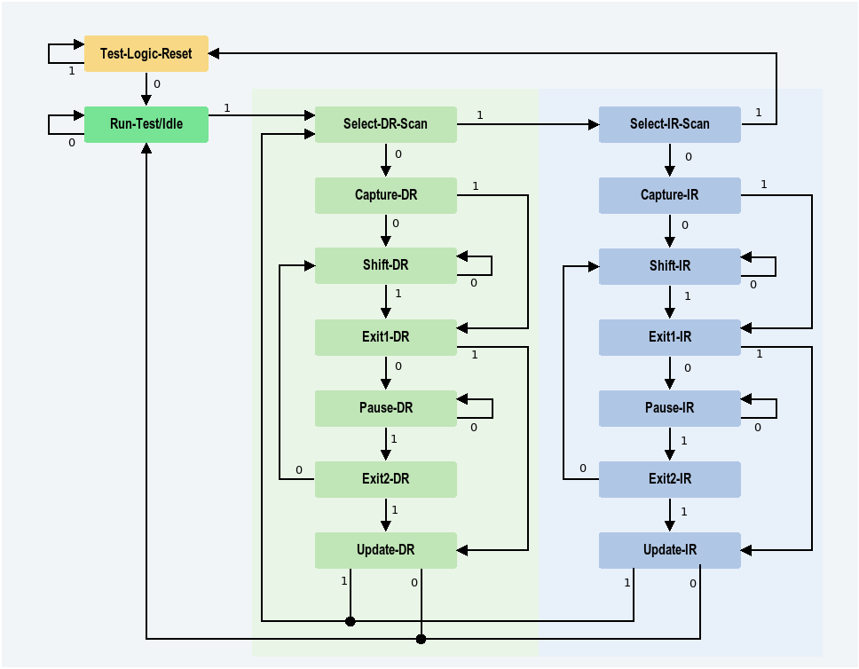

Title: Joint Test Action Group (JTAG)  
Date: 2025-05-12  
Category: Automotive  
Tags: Debugger, JTAG  
Summary: Securing JTAG in Embedded Systems.

# Introduction

In the realm of embedded systems, JTAG plays a critical role in development and debugging. It provides developers with low-level access to hardware components including memory, registers, and more. In this post, I’ll explore the JTAG protocol and the practical importance of securing it — not just for functionality, but to protect the integrity and authentication of embedded systems.

## JTAG Summary

JTAG typically operates using a standard pin interface:

- **TDI** (Test Data In)  
- **TDO** (Test Data Out)  
- **TMS** (Test Mode Select)  
- **TCLK** (Test Clock)  
- **TMODE** (Optional Mode Select)  
- **TRST** (Test Reset, optional)

The operation is governed by a finite state machine known as the **TAP (Test Access Port)** controller.

JTAG works through two main paths:

- **Instruction Register (IR) Path** (shown in blue): Loads instructions to select and control data registers.
- **Data Register (DR) Path** (shown in green): Transfers data to/from selected registers (e.g., boundary scan, IDCODE, etc.).

  
*Source: [All About Circuits – JTAG TAP State Machine](https://www.allaboutcircuits.com/technical-articles/jtag-test-access-port-tap-state-machine/)*

## JTAG Security

Due to its powerful capabilities, JTAG is a prime target for attackers seeking to:

- Read sensitive memory contents
- Inject malicious code
- Bypass bootloaders or secure boot mechanisms
- Tamper with firmware or data

Securing JTAG is therefore essential for protecting embedded devices.

### Hardware-Based Protections

1. **No Debug Mode**  
   All JTAG functionality is disabled at the hardware level during production. This method is irreversible and highly secure.

2. **Secure JTAG Mode**  
   The interface is locked and requires cryptographic authentication or hardware keys to unlock. Only trusted tools with the correct credentials can gain access.

   - Common in automotive ECUs and SoCs
   - Often backed by hardware security modules (HSMs)

### Software-Based Protections

While not primary, software methods can complement hardware defenses:

- Enable or disable JTAG access at runtime
- Apply software checks to prevent unauthorized access

> ⚠️ **Note:** Software-based security is inherently weaker — if an attacker can gain control of execution, they can often bypass such protections.

## Conclusion

JTAG is indispensable for embedded development, but also a significant attack surface. Securing it using a layered approach (preferably hardware-enforced) is crucial for safeguarding modern automotive and industrial embedded systems.
