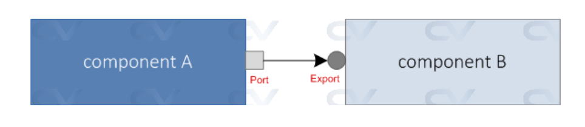

Title: SystemVerilog and UVM Framework  
Date: 2025-08-15  
Category: Digital VLSI  
Slug: HDL-Verification  
Author: Tung Nguyen  
Summary: SystemVerilog and UVM framework  
<!-- PELICAN_END_SUMMARY -->

## Introduction
SystemVerilog is both a **Hardware Description Language (HDL)** and a **Hardware Verification Language (HVL)**. Compared to Verilog, it extends the language with **object-oriented programming (OOP)**, **constrained-random verification**, and **assertion-based testing**.  

Reference: [SystemVerilog Basics](https://vlsiverify.com/systemverilog/)

In this blog, I will focus on important concepts in SystemVerilog and the **UVM (Universal Verification Methodology)** framework used for verification.  

---

## Interfaces
Interfaces provide a way to encapsulate and bundle signals into a single logical group. They help reduce connection complexity between modules.  

- **Modports**: Define the direction of signals (input, output, inout) for specific module connections.  
- **Clocking blocks**: Define a timing domain, ensuring signals are sampled and driven synchronously with a particular clock. This avoids race conditions and simplifies timing control.  

---

## Specialized Always Blocks
SystemVerilog introduces specialized procedural blocks to clearly define design intent.   

1. **always_comb**  
  Used to describe **combinational logic**.  
  Sensitivity list is inferred automatically.  
  Prevents accidental latch inference

2. **always_ff**  
  Used to describe **sequential logic (flip-flops, registers)**.  
  Requires an edge-sensitive event control (`posedge` or `negedge`).  
  Prevents latch inference inside.  

3. **always_latch**  
  Used to describe **level-sensitive latches**.  
  Ensures latches are intentional and explicit in design.  

These constructs improve **readability, synthesis safety, and simulation consistency** compared to traditional `always` blocks.  

---

## UVM (Universal Verification Methodology)
In summary, UVM builds on two fundamental base classes:
- **uvm_object**: is a data structure used for testbench configuration and it is the base class available for component and transaction. 

- **uvm_transaction**:  UVM transaction is used for generating stimulus and test cases. For user-defined transaction, **uvm_sequence_item** inherits from this class.

- **uvm_component**: A base class for hierachial testbench components. Examples include: `uvm_env`, `uvm_agent`, `uvm_driver`, `uvm_sequencer`, `uvm_monitor`, and `uvm_test`.  

### Typical UVM Hierarchy and Flow
1. **uvm_test**: Top-level entry point. Configures the environment and launches test sequences.  
2. **uvm_sequence**: Generates stimulus in the form of `uvm_sequence_item` transactions.  
3. **uvm_sequencer → uvm_driver**: The sequencer delivers transactions to the driver. The driver translates them into pin-level activity on the DUT via an interface.  
4. **uvm_monitor**: Observes DUT signals, reconstructs transactions, and publishes them using analysis ports.  
5. **Subscribers and Scoreboard**:  
- Subscribers collect transactions for functional coverage.  
- The scoreboard checks transactions against a reference model for correctness.  

The **UVM config database** is often used to pass configuration objects from higher-level components (like the test) down to lower-level components (env,agent).  

### Transaction-Level Modeling (TLM)
UVM uses **Transaction-Level Modeling (TLM)** for communication between testbench components. The good part about this setup is that it isolates a component from the changes in other components, and promotes reusability and flexibility because now you can just swap a component with another which also have a TLM interface.

```CPP
class apb_transaction extends uvm_object
typedef enum {READ,WRITE} transaction_kind;
rand bit [31:0] addr; //Address
rand logic [31:0] data;  //Data - for write and read
rand transaction_kind cmd;
endclass
```
apb_transaction class object will be a transaction that can be sent from componentA to componentB via TLM interface ports port and export.



Common TLM interfaces include:  
- **put_port / export** → Push transactions. The receiver will implement the **put** port
- **get_port / export** → Pull transactions. The sender define the **get**port
- **tlm_fifo** → Provides queue-like storage for transactions.  

### Factory
The **UVM factory mechanism** allows the user to subsitute an existing class object by any of its inherited child class objects. Therefore classes needs to be registered with the factory via UVM macros **uvm_object_utils**, **`uvm_component_utils** .

Factory override method:
```CPP
// Override all the objects of a particular type
set_type_override_by_type ( uvm_object_wrapper original_type,
                            uvm_object_wrapper override_type,
                            bit replace=1);

set_type_override_by_name ( string original_type_name,
                            string override_type_name,
                            bit replace=1);

// Override a type within a particular instance
set_inst_override_by_type (uvm_object_wrapper original_type,
                           uvm_object_wrapper override_type,
                           string full_inst_path);

set_inst_override_by_name (string original_type_name,
                           string override_type_name,
                           string full_inst_path);
```

Use case: Assume that the existing testbench is use "Version1" transaction class and is used throughout the testbench. If "Version2" transaction is released and the testbench is required to update and start using new protocol, there would be many places in the testbench that would require an update in code. Therefore, factory is indeed useful. nstead of text substitution of class name of existing data packet, a child class object can be created that makes necessary modifications for 2.0 and the factory can be used to return the newly defined class object in all places within the testbench instead of the first one.
 

---

## Conclusion
SystemVerilog extends Verilog with strong design and verification features, while UVM provides a structured methodology for building reusable, scalable verification environments. Together, they are widely used for **modern digital design verification**. For more details, explore the Accellera UVM Standard or my Github sample projects.  