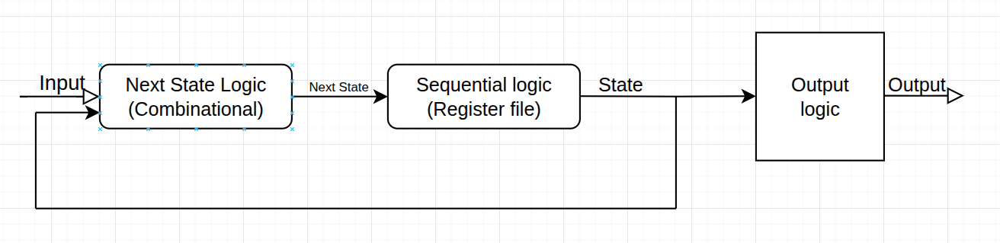

Title: General Concepts in Digital Design
Date: 2025-05-11
Category: Digital Design
Slug: general-digital-design
Author: Tung Nguyen
Summary: Combinational logic and sequential logic
 <!-- PELICAN_END_SUMMARY -->

## Timing Basics

- **Setup Time**: Time input must be stable **before** clock edge.
- **Hold Time**: Time input must be stable **after** clock edge.
- **Aperture Time**: `Setup + Hold` time.
- **Recovery Time**: Time async reset/set must be **inactive before** clock edge.
- **Removal Time**: Time async reset/set must be **inactive after** clock edge.
- **Metastability**: Flip-flops enter unpredictable states if timing is violated.

## Combinational  and Sequetial Logic
Digital systems are built using two fundamental types of logic circuits: **combinational logic** and **sequential logic**. Understanding the distinction is essential for designing reliable hardware systems.

### 🔹 Combinational Logic

Combinational logic circuits compute outputs purely based on the **current inputs** — no memory is involved.

#### ✅ Characteristics:
<ul>
<li> No storage elements </li>
<li>  Output changes immediately when inputs change</li>
<li>  Examples: Gates, Adders, Multiplexers, Decoders </li>
<li> Hazard: Glitches in outputs due to gate delays and improper logic design. </li>
</ul>

#### 🧠 Example: 2-to-1 Multiplexer

```verilog
module mux2to1(input a, input b, input sel, output y);
    assign y = sel ? b : a;
endmodule
```
### 🔹 Sequential Logic
Sequential logic circuits produce outputs based on both current inputs and past history — meaning they have memory elements.

#### ✅ Characteristics:
<ul>
<li> Contains storage elements (like flip-flops or latches) </li>
<li> Outputs depend on input and stored state </li>
<li> Can be synchronous (clock-driven) or asynchronous </li>

</ul>

### General model of digital system


## Finite State Machines (FSM)
- Deterministic finite automata define by the following tuple:
  - Initial state
  - Set of accepting states
  - Transition function
  - Output
  - Input alphabet

## Assignments in SystemVerilog

- **Blocking Assignment (`=`)**: Executes sequentially.
- **Non-Blocking Assignment (`<=`)**: All updates scheduled at end of time step.

## Types of Assignments

- **Procedural Assignments**: Used in `always`, `initial`, `task`, `function`.
- **Continuous Assignments**: Assigned directly to `wire`.

> Note: `if`, `else`, and `case` must be used **within procedural blocks**.

## SystemVerilog Features

- **Classes & Inheritance**: For OOP-style modeling.
- **Randomization**: Use `rand` and `constraint` for random test generation.
- **Bit Ordering**: `[2:0]` means MSB (`2`) to LSB (`0`).

## Modules
```systemverilog
module example (
  input logic clk,
  input logic rst,
  output logic [2:0] out
);
// ...
endmodule
```


