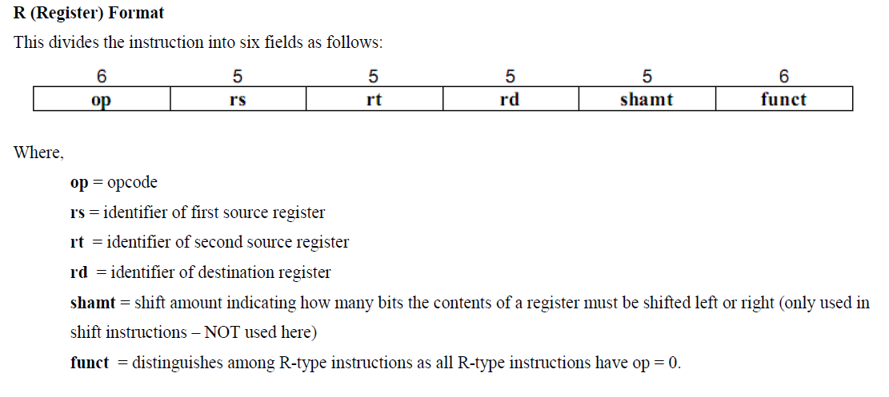
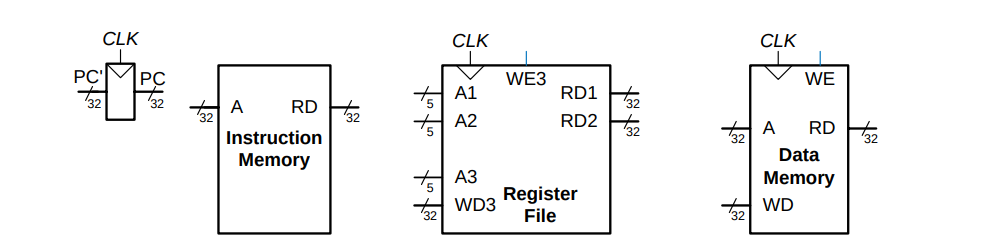
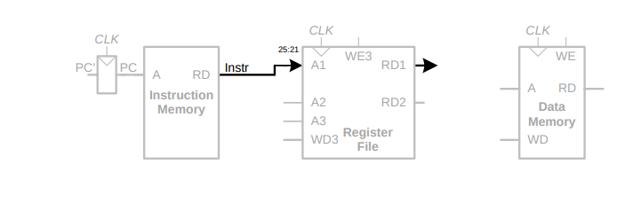
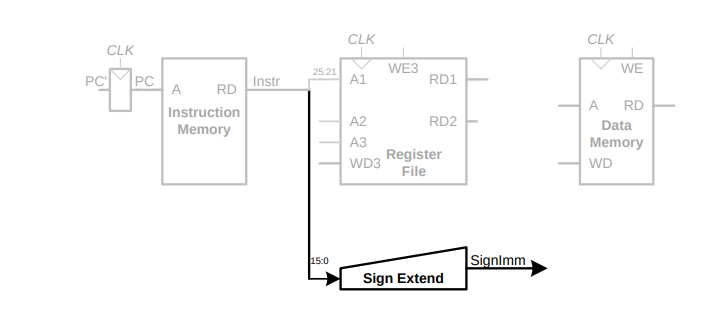
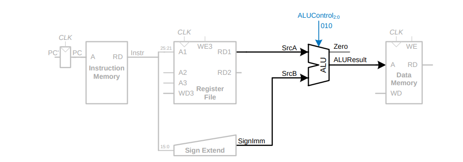
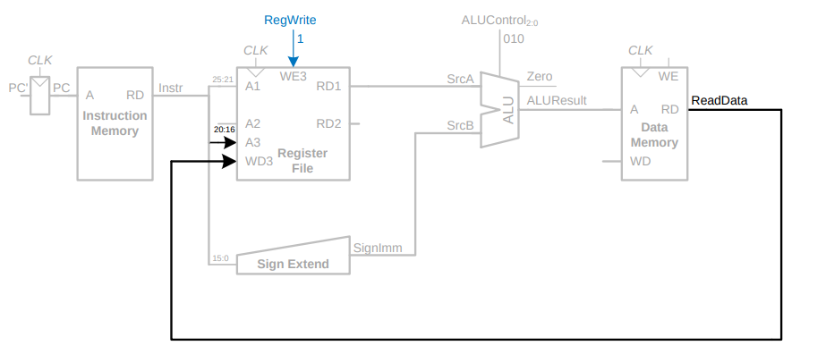
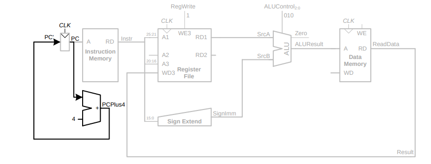
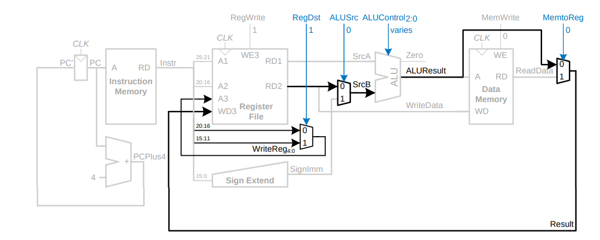
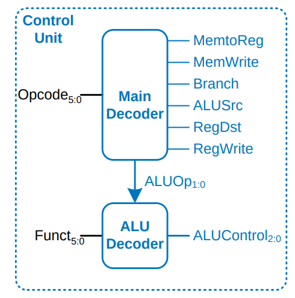
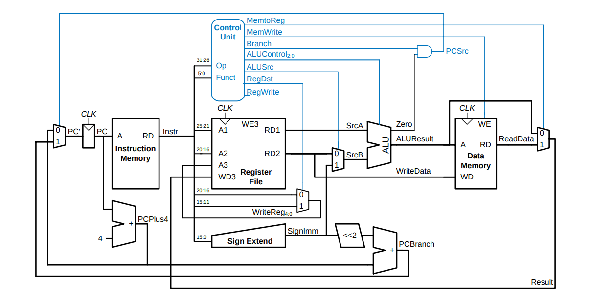

Title: Single Cycle Processor 
Date: 2025-09-05  
Category: Digital VLSI  
Slug: single-cycle-processor  
Author: Tung Nguyen  
Summary: MIPS microprocessor design  
<!-- PELICAN_END_SUMMARY -->

## Introduction

This blog post explores the **MIPS microarchitecture**—the concrete arrangement of registers, ALUs, finite-state machines, memories, and other logic blocks required to implement the processor’s architecture.  

Before diving into the datapath and control unit design of a single-cycle MIPS processor, it is essential to first understand the **MIPS architecture**, including its instruction set, operands, and architectural state. These form the foundation of the datapath elements and control signals we will develop later.  

**Reference:** *Digital Design and Computer Architecture* by David Harris  

---

## MIPS Architecture

The MIPS instruction set is designed around the principle of making the **common case fast**. It includes only simple, frequently used instructions. More elaborate or less common operations are expressed as **sequences of simpler instructions**. This makes MIPS a **Reduced Instruction Set Computer (RISC)** architecture.  

By contrast, **Complex Instruction Set Computers (CISC)**, such as Intel’s IA-32 architecture, include complex instructions like "string move," which copy entire blocks of memory. While such instructions may reduce the number of lines of code, they increase hardware complexity and slow down the execution of simpler instructions.  

The RISC design philosophy minimizes hardware overhead by:  
- Keeping the instruction set **small** and **regular**.  
- Using **fixed-length instructions** (32 bits each) for simpler decoding.  
- Relying heavily on a large **register file**, with memory accessed only through explicit load/store instructions.  

> Example: If an instruction set defines 64 simple operations, only 6 bits are needed to encode the operation (`log2(64) = 6`). A CISC architecture with 256 operations would require 8 bits for encoding, making decoding more complex.  

---

### Instruction Subset

For the purpose of designing a single-cycle processor, we will focus on a **subset** of the MIPS instruction set. This subset is representative enough to capture the essential datapath and control structures:

- **R-type (Register format)** – arithmetic and logical operations on registers  
  - `add rd, rs, rt` – `rd ← rs + rt`  
  - `sub rd, rs, rt` – `rd ← rs - rt`  
  - `and rd, rs, rt` – `rd ← rs & rt`  
  - `or  rd, rs, rt` – `rd ← rs | rt`  

- **I-type (Immediate format)** – arithmetic with constants, load/store memory operations  
  - `addi rt, rs, imm` – `rt ← rs + imm`  
  - `lw rt, offset(rs)` – load word from memory at `rs + offset`  
  - `sw rt, offset(rs)` – store word into memory at `rs + offset`  

- **J-type (Control flow)** – branching and jumping  
  - `beq rs, rt, offset` – branch to `PC + 4 + offset<<2` if `rs == rt`  

This minimal set is sufficient to illustrate **arithmetic, logic, memory access, and control flow**, the core building blocks of any processor.

---

## 1. Architectural State and Instruction Set

The **architectural state** consists of the storage elements visible to the programmer:

- **32 General-Purpose Registers (GPRs):**  
  - Each is 32 bits wide.  
  - `$0` is hardwired to constant 0.  
  - Conventionally divided into temporaries (`$t0–$t9`), saved registers (`$s0–$s7`), arguments (`$a0–$a3`), etc.  

- **Program Counter (PC):**  
  - Holds the address of the next instruction.  
  - Increments by 4 for sequential execution or is updated by branches/jumps.  

Together, the register file and program counter form the **state elements** that are updated as instructions execute.  

---

### Instruction Formats

MIPS instructions use three primary formats, all 32 bits wide:  

- **R-type:** `[op (6)][rs (5)][rt (5)][rd (5)][shamt (5)][funct (6)]`  
- **I-type:** `[op (6)][rs (5)][rt (5)][imm (16)]`  
- **J-type:** `[op (6)][address (26)]`  

These formats simplify hardware decoding since each field has a fixed position and size.  

---

Example:

---

## 2. Design Path: Single-Cycle Processor
With the **architectural state** and **instruction set** understood, we are ready to design the datapath that can fetch, decode, and execute these instructions, and then derive the control signals required to orchestrate each step.

### 2.1 32-bit Datapath

**State elements:** Program counter, instruction memory, data memory, and register file.

- **Program Counter (PC):** A 32-bit register whose output provides the current instruction address (PC), and whose input (`PC'`) points to the next instruction address.  
- **Instruction Memory:** Has a single read port. Takes the PC as input (instruction address) and outputs a 32-bit instruction.  
- **Register File:** Has two 5-bit read address ports (`Rs`, `Rt`) and one 5-bit write address port (`Rd`). Includes a 32-bit write data input to support immediate addressing.

#### Example: Single-Cycle Datapath for `lw` Instruction

a. Instruction Fetch  
b. Operand Read (Decode)  

c. Sign-extend the Immediate  

d. Memory Address Computation  

e. Write Back  

f. Determine Next Instruction Address  

---

### Generalized Datapath for R-Type Instruction

---

### 2.2 Control Unit

Control signals are generated based on the **opcode** (bits [31:26]) and **function code** (bits [5:0]) of the instruction.

---

### Complete Single-Cycle MIPS Processor

---

## 3. Verilog Design and UVM verification model
(*Updated on Sep, 2025*)
https://github.com/tungnguyen1610?tab=repositories