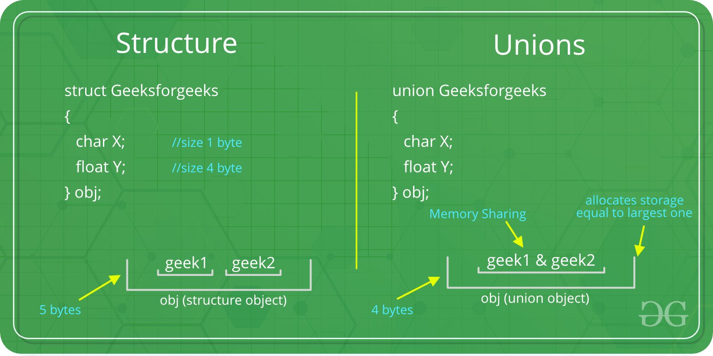

Title: Embedded C Structure  
Date: 2025-05-23  
Category: Programming  
Tags: struct, union, bitfield  
Summary: A detailed comparison between struct, union, and bit-field in Embedded C.

In C programming, especially within embedded systems, `struct` and `union` are user-defined data types that allow grouping variables of different types under one name. However, they differ fundamentally in how they allocate and manage memory.

---

## 🔹 Struct vs. Union

### ✅ `struct`
- Each member occupies **its own memory space**.
- Total size = **sum of all members' sizes** (plus possible padding for alignment).
- Members are stored **contiguously** in memory.
#### Struct padding and alignment
When writing C code for low-level or memory-constrained systems, it's important to understand how data structures are laid out in memory. The compiler often inserts **padding bytes** between struct members to satisfy **alignment requirements**. This can lead to increased memory usage if not handled carefully.

---

### 🔍 Code Example: Unexpected Struct Size

```c
#include <stdio.h>
#include <stdint.h>

typedef struct DataInfor
{
    long long timestamp; // 8 bytes
    float output;        // 4 bytes
    uint16_t date;       // 2 bytes
    int input;           // 4 bytes
    double test;         // 8 bytes
    uint8_t day;         // 1 byte
} Infor;

int main()
{
    printf("The total size of struct: %ld\n", sizeof(Infor));
    return 0;
}
```
#### ❓ Why Struct Padding Happens

- **Alignment**: Most systems require variables to be aligned in memory according to their type size.  
  _Example: `int` should be aligned to a 4-byte boundary._

- **Padding**: The compiler inserts **unused bytes** between fields to maintain proper alignment.

- **Struct Alignment**: The total size of the struct is **rounded up** to the nearest multiple of the **largest member’s alignment** requirement (often 8 bytes).

---

#### ✅ Best Practices to Save Memory (If Necessary)

- 🔹 **Reorder struct members from largest to smallest type**  
  _✔ Recommended – avoids unnecessary padding._

- 🔹 **Use `__attribute__((packed))` (GCC/Clang)**  
  _⚠ Not recommended unless absolutely necessary – can cause **misaligned memory access**, which may lead to **performance penalties** or **runtime errors** on some architectures._

### ✅ `union`

- All members **share the same memory location**.
- Total size = **size of the largest member**.
- Only one member can hold a valid value at a time.

### 📊 Visual Comparison



---

## 🔸 Bit-Fields in Structures

Sometimes, we know a variable only needs a few bits (e.g., a month value ranges from 1–12). Using bit-fields helps **save memory**, which is crucial in embedded systems with limited storage.

### 📌 Syntax:

```c
struct {
    data_type member_name : width_in_bits;
};
```

### Example
```
struct date {
    int month : 4;
};
```
Bit-fields are powerful, but there are caveats:

If a field’s value exceeds its bit-width, unexpected behavior may 
occur.

In the example, when printing value of month to stdout, The output comes out to be negative. What happened behind is that the value 31 was stored in 4 bit signed integer which is equal to 1111.

